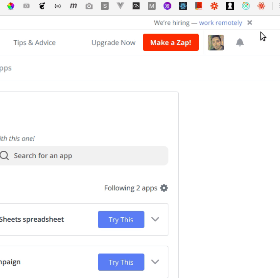
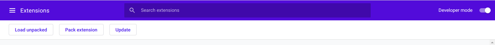

# Zapier Utils [Chrome Extension]

> ℹ Work in progress

This project provides you with tools that allow you perform actions on Zapier that can't be done with the current version of its UI.

## Features

This extension currently supports the following tools:

- Find the zap that is associated with a webhook URL.

We'll keep adding more tools in the future.

## Demo

### Find The zap that is associated with a webhook URL

## Installation

1. Clone or download this repository.
2. Go to `chrome://extensions`.
3. Enable **Developer mode** and click on **Load unpacked**

4. Go to the repository folder that you've just downloaded and select the `build` folder then your browser will load the extension.

5. Make sure you open Zapier website in a new tab after installing the extension.

That's it. Enjoy! :)
